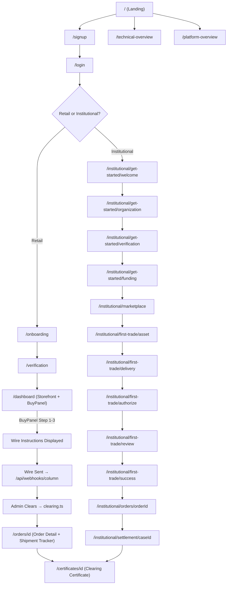

# AurumShield: Complete Endpoint Map — Every Step of the Buyer Journey

Every UI page and backend endpoint mapped to the buyer process, for both **Retail** and **Institutional** flows.

---

## PHASE 0: Discovery & Due Diligence (Pre-Auth)

> *"I'm researching AurumShield. I haven't signed up yet."*

| What Happens | UI Endpoint | Backend |
|:--|:--|:--|
| Marketing landing page | **`/`** → `MarketingLanding` component | — |
| Full platform architecture explainer | **`/platform-overview`** | — |
| 8-step Goldwire pipeline breakdown | **`/technical-overview`** | — |
| Live gold spot price feed | — (embedded in storefront/terminal) | **`/api/oracle/pricing`** (multi-oracle medianized spot) |

---

## PHASE 1: Account Creation & Authentication

> *"I'm signing up."*

| What Happens | UI Endpoint | Backend |
|:--|:--|:--|
| Create an account | **`/signup`** | Clerk webhook: **`/api/webhooks/clerk`** |
| Log in (existing user) | **`/login`** | Clerk webhook: **`/api/webhooks/clerk`** |
| Operator/demo bypass login | **`/dev/signin`** | Clerk (demo mode) |

---

## PHASE 2: Identity Verification & Compliance (KYB)

> *"I'm proving who I am before I can buy."*

### Retail Flow

| What Happens | UI Endpoint | Backend |
|:--|:--|:--|
| Onboarding entry | **`/onboarding`** | Server action: `onboarding.ts` |
| Compliance sub-step | **`/onboarding/compliance`** | Server action: `compliance-screening-actions.ts` |
| Multi-step verification wizard | **`/verification`** | Server action: `compliance-decisions.ts` |
| Individual verification step | **`/verification/steps/[stepId]`** | Webhook receivers (below) |

### Institutional Flow

| What Happens | UI Endpoint | Backend |
|:--|:--|:--|
| Welcome / concierge intro | **`/institutional/get-started/welcome`** | — |
| Organization & LEI registration | **`/institutional/get-started/organization`** | Server action: `gleif-verify.ts` (GLEIF LEI validation) |
| KYB identity verification | **`/institutional/get-started/verification`** | Webhook: **`/api/webhooks/kycaid`**, **`/api/webhooks/veriff`**, **`/api/webhooks/idenfy`**, **`/api/webhooks/diro`** |
| Treasury funding method setup | **`/institutional/get-started/funding`** | Server action: `treasury-actions.ts` |
| Compliance case review (admin) | **`/institutional/compliance`** | Server action: `compliance-decisions.ts`, `compliance-queries.ts` |

### Compliance Webhook Receivers (All Flows)

| Provider | Endpoint | Purpose |
|:--|:--|:--|
| KYCaid | **`/api/webhooks/kycaid`** | KYB verification result callback |
| Veriff | **`/api/webhooks/veriff`** | KYB verification result callback |
| iDenfy | **`/api/webhooks/idenfy`** | KYB verification result callback |
| Diro | **`/api/webhooks/diro`** | Document verification callback |
| Clerk | **`/api/webhooks/clerk`** | Auth event sync |

---

## PHASE 3: Browsing the Storefront / Marketplace

> *"I'm looking at gold to buy."*

| What Happens | UI Endpoint | Backend |
|:--|:--|:--|
| **Retail storefront** — product catalog (1oz, 10oz, 1kg, 400oz bars) | **`/dashboard`** → `DashboardUI.tsx` (retail BuyPanel) | Server action: `inventory-actions.ts` |
| **Institutional marketplace** — LBMA-certified allocation grid | **`/institutional/marketplace`** | Server action: `inventory-actions.ts` |
| Global marketplace (shared) | **`/marketplace`** | Server action: `inventory-actions.ts` |
| **OTC Trading Terminal** — institutional execution | **`/transactions`** → `TransactionsUI.tsx` | **`/api/oracle/pricing`** (live spot) |
| Initiate new transaction | **`/transactions/new`** | Server action: `settlement-actions.ts` |

---

## PHASE 4: Checkout — Selecting Product, Destination & Logistics

> *"I've picked my gold. I'm choosing vault vs. ship and seeing the exact total."*

### Retail Flow (BuyPanel 3-Step Wizard)

The retail checkout is a **client-side wizard inside the Dashboard BuyPanel**, not separate pages:

| Step | UI Location | Backend |
|:--|:--|:--|
| **Step 1**: Select product & quantity | **`/dashboard`** → BuyPanel Step 1 | Client-side calculation |
| **Step 2**: Choose destination (Vault vs. Ship) + address + freight quote | **`/dashboard`** → BuyPanel Step 2 | Server action: `logistics.ts` → `verifyAddressAndQuote` (armored freight math) |
| **Step 3**: Grand total + wire instructions | **`/dashboard`** → BuyPanel Step 3 | Server action: `banking.ts` → `generateFiatDepositInstructions` |
| Order creation (atomic) | **`/dashboard`** → BuyPanel confirm | Server action: `orders.ts` → `createRetailOrder` + `inventory-actions.ts` → `executeAtomicCheckout` |

### Institutional Flow (5-Step Wizard)

| Step | UI Endpoint | Backend |
|:--|:--|:--|
| **Step 1**: Asset selection (product, weight, quantity) | **`/institutional/first-trade/asset`** | Server action: `first-trade-actions.ts` |
| **Step 2**: Delivery method (vault vs. armored ship) | **`/institutional/first-trade/delivery`** | Server action: `logistics.ts` |
| **Step 3**: WebAuthn authorization (dual-auth) | **`/institutional/first-trade/authorize`** | Server action: `first-trade-actions.ts`, **`/api/fingerprint`** |
| **Step 4**: Full review — price, premiums, fees, freight, grand total | **`/institutional/first-trade/review`** | Server action: `first-trade-actions.ts`, `banking.ts` |
| **Step 5**: Confirmation & routing to order | **`/institutional/first-trade/success`** | Server action: `orders.ts` |

### Standalone Checkout (Legacy/Direct)

| What Happens | UI Endpoint | Backend |
|:--|:--|:--|
| Direct checkout page | **`/checkout`** | Server actions: `banking.ts`, `logistics.ts`, `orders.ts` |

---

## PHASE 5: Payment — Wire Transfer Instructions

> *"I'm sending my money via Fedwire."*

| What Happens | UI Endpoint | Backend |
|:--|:--|:--|
| Wire instructions displayed (Column N.A. FBO account) | Inline on **`/dashboard`** (retail BuyPanel Step 3) or **`/institutional/first-trade/review`** | Server action: `banking.ts` → `generateFiatDepositInstructions` |
| Virtual FBO account creation | — (backend only) | `lib/banking/column-adapter.ts` → Column N.A. API |
| Wire arrival webhook | — (backend only) | **`/api/webhooks/column`** and **`/api/webhooks/banking`** |

---

## PHASE 6: Funds Clearing & Fee Sweep

> *"My wire arrived. The platform is clearing my funds and extracting the 1% fee."*

| What Happens | UI Endpoint | Backend |
|:--|:--|:--|
| Admin funds clearing (Ledger Sweep Preview) | **`/admin`** (admin panel) | Server action: `clearing.ts` → `manuallyClearFunds` |
| Settlement case management | **`/institutional/settlement/[caseId]`** | Server action: `settlement-actions.ts`, `settlement-queries.ts` |
| Settlement status API | — | **`/api/settlement-status`** |

---

## PHASE 7: Gold Allocation & Title Transfer (Goldwire Execution)

> *"My gold is now legally mine."*

| What Happens | UI Endpoint | Backend |
|:--|:--|:--|
| Transaction detail (execution record) | **`/transactions/[id]`** | Server action: `settlement-actions.ts` |
| Settlement record (institutional) | **`/institutional/settlement/[caseId]`** | Server action: `settlement-queries.ts` |
| Refinery/allocation webhook | — (backend only) | **`/api/webhooks/refinery`** |

---

## PHASE 8: Post-Settlement — Order Tracking & Delivery

> *"My order is complete. Where's my gold?"*

### Order History & Detail

| What Happens | UI Endpoint | Backend |
|:--|:--|:--|
| **Retail** order history grid | **`/orders`** | Server action: `orders.ts` |
| **Retail** order detail (shipment tracker, allocation proof) | **`/orders/[id]`** | Server action: `orders.ts` |
| **Institutional** order history | **`/institutional/orders`** | Server action: `orders.ts`, `settlement-queries.ts` |
| **Institutional** order detail | **`/institutional/orders/[orderId]`** | Server action: `orders.ts` |

### Armored Shipment Tracking (STP)

| What Happens | UI Endpoint | Backend |
|:--|:--|:--|
| Armored Shipment Tracker (Brink's) — promoted to top of order detail | **`/orders/[id]`** (top of center panel) | **`/api/webhooks/logistics`** (Brink's API pings), Server action: `logistics.ts` |
| STP auto-dispatch (tracking # generation) | — (backend only) | Server action: `logistics.ts` |

---

## PHASE 9: Cryptographic Proof — Clearing Certificate

> *"Give me proof of everything."*

| What Happens | UI Endpoint | Backend |
|:--|:--|:--|
| View clearing certificate (SHA-256 signed) | **`/certificates/[id]`** | **`/api/certificates`** (certificate engine, AWS KMS ECDSA signing) |
| Settlement receipt | **`/settlement/receipt`** | Server action: `settlement-queries.ts` |

---

## PHASE 10: Ongoing Account Management

> *"I'm a returning buyer managing my portfolio."*

| What Happens | UI Endpoint | Backend |
|:--|:--|:--|
| Account settings / profile | **`/account`** | Server action: `onboarding.ts` |
| Compliance status | **`/compliance`** | Server action: `compliance-queries.ts` |
| Institutional portal home (aggregated view) | **`/institutional`** | Server actions: `treasury-queries.ts`, `settlement-queries.ts` |
| Risk configuration (admin) | — | **`/api/risk-config`** |

---

## Server Actions Index

All "use server" actions live in `src/actions/`:

| File | Purpose | Used In Phases |
|:--|:--|:--|
| `banking.ts` | Generate wire instructions, FBO accounts, trigger payouts | 5, 6 |
| `clearing.ts` | Manual funds clearing, fee sweep | 6 |
| `compliance-decisions.ts` | Approve/reject compliance cases | 2 |
| `compliance-queries.ts` | Read compliance state | 2, 10 |
| `compliance-screening-actions.ts` | Trigger screening (OFAC/sanctions) | 2 |
| `first-trade-actions.ts` | Institutional checkout wizard logic | 4 |
| `gleif-verify.ts` | LEI validation against GLEIF | 2 |
| `inventory-actions.ts` | Product catalog, atomic checkout | 3, 4 |
| `logistics.ts` | Armored freight calculation, shipment tracking | 4, 8 |
| `notifications.ts` | Buyer notifications | 8 |
| `onboarding.ts` | Account setup | 1, 2 |
| `orders.ts` | Create/read orders | 4, 8 |
| `settlement-actions.ts` | Execute Goldwire, manage settlements | 6, 7 |
| `settlement-queries.ts` | Read settlement state | 7, 8, 9 |
| `treasury-actions.ts` | Treasury funding setup | 2 |
| `treasury-queries.ts` | Read treasury state | 10 |

---

## Visual Flow Summary

