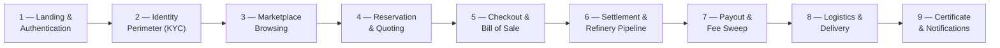
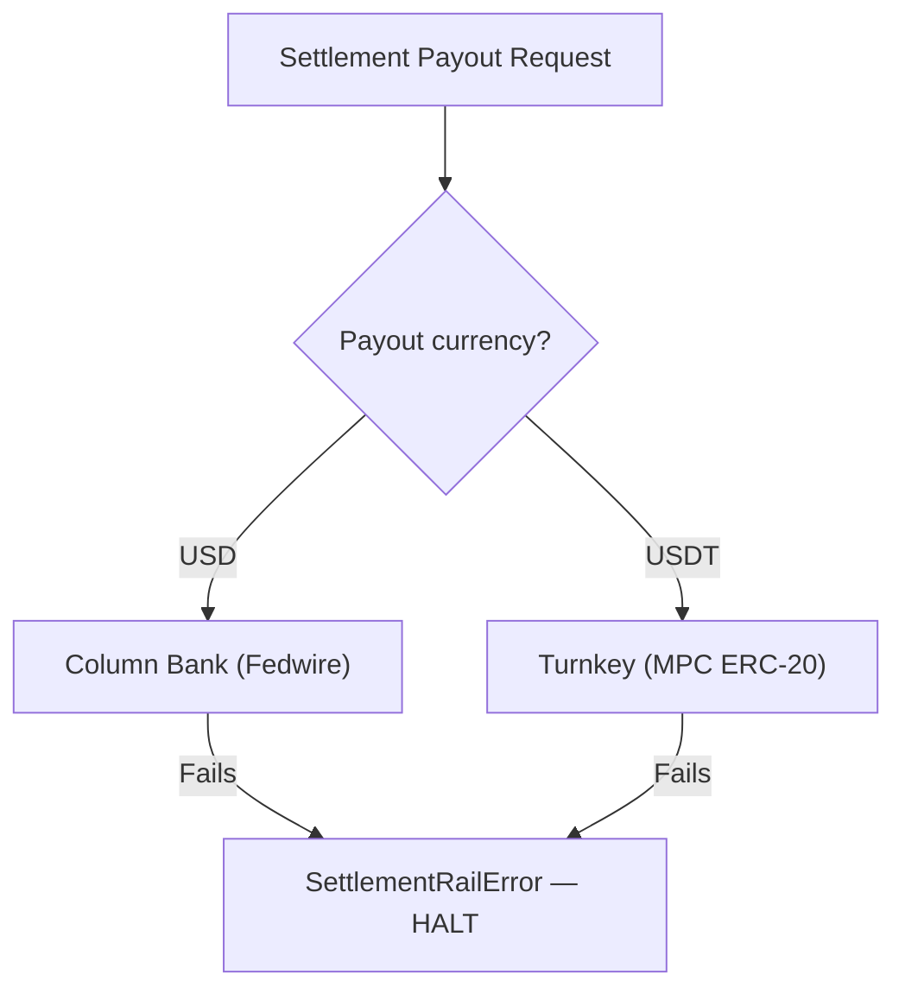
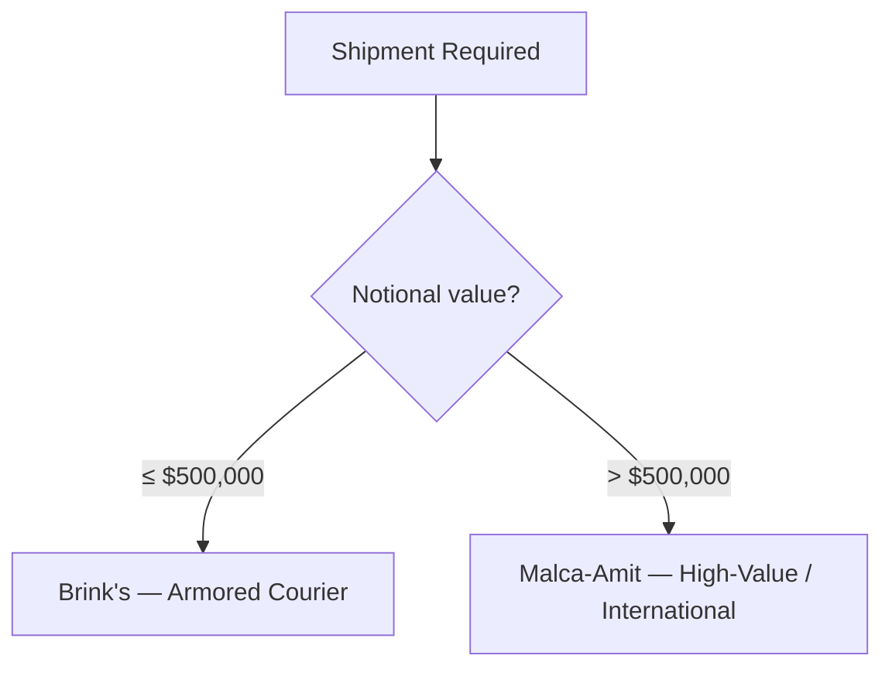

# AurumShield — Complete Buyer Journey

> From first click to fully settled, custody-transferred gold with clearing certificate in hand.

---

## Journey Overview

```mermaid
flowchart LR
  A["1 — Landing &\nAuthentication"] --> B["2 — Identity\nPerimeter (KYC)"]
  B --> C["3 — Marketplace\nBrowsing"]
  C --> D["4 — Reservation\n& Quoting"]
  D --> E["5 — Checkout &\nBill of Sale"]
  E --> F["6 — Settlement &\nRefinery Pipeline"]
  F --> G["7 — Payout &\nFee Sweep"]
  G --> H["8 — Logistics &\nDelivery"]
  H --> I["9 — Certificate\n& Notifications"]
```

---

## Phase 1 — Landing & Authentication

### What happens

Buyer navigates to `https://aurumshield.vip`. The app loads the Next.js shell, renders the login page, and authenticates the user.

### Steps

| #   | Action                                             | Tool / System                                                                                                                                          |
| --- | -------------------------------------------------- | ------------------------------------------------------------------------------------------------------------------------------------------------------ |
| 1   | DNS resolves `aurumshield.vip`                     | **Route 53** (AWS) → ALB                                                                                                                               |
| 2   | HTTPS terminates at the load balancer              | **ACM Certificate** on **ALB**                                                                                                                         |
| 3   | Request hits ECS Fargate task (Next.js standalone) | **AWS ECS Fargate** (2-task rolling deploy)                                                                                                            |
| 4   | Buyer arrives at `/login`                          | **Next.js 16** SSR                                                                                                                                     |
| 5   | Buyer enters credentials (email/password or OAuth) | **Auth Provider** ([auth-store.ts](file:///c:/Users/jimbo/OneDrive/Desktop/gold/src/lib/auth-store.ts))                                                |
| 6   | Device fingerprinting fires on page load           | **Fingerprint.com** client-side SDK (`useVisitorData()`)                                                                                               |
| 7   | Server verifies the fingerprint visitor ID         | [fingerprint-adapter.ts](file:///c:/Users/jimbo/OneDrive/Desktop/gold/src/lib/fingerprint-adapter.ts) → **Fingerprint.com Server API** (`api.fpjs.io`) |
| 8   | Bot detection, confidence scoring, velocity checks | Fingerprint risk heuristics (bot prob > 0.5 = reject, confidence < 0.85 = flag, >10 visits/24h = flag)                                                 |
| 9   | Role-based routing directs buyer to `/buyer` page  | Traffic-cop logic in [page.tsx](file:///c:/Users/jimbo/OneDrive/Desktop/gold/src/app/page.tsx)                                                         |

### Key files

- [auth-store.ts](file:///c:/Users/jimbo/OneDrive/Desktop/gold/src/lib/auth-store.ts) — session, user, org state
- [fingerprint-adapter.ts](file:///c:/Users/jimbo/OneDrive/Desktop/gold/src/lib/fingerprint-adapter.ts) — device trust verification

---

## Phase 2 — Identity Perimeter (KYC/KYB)

### What happens

Before the buyer can transact, they must pass the identity perimeter. This is a multi-step verification flow that gates access to the marketplace and settlement.

### Steps

| #   | Action                                                                    | Tool / System                                                                                                                                                                                                                                      |
| --- | ------------------------------------------------------------------------- | -------------------------------------------------------------------------------------------------------------------------------------------------------------------------------------------------------------------------------------------------- |
| 1   | Buyer navigates to `/onboarding` wizard (3-step progressive disclosure)   | Next.js page with **Zod** form validation                                                                                                                                                                                                          |
| 2   | **Step 1 — Email & Phone Confirmation** (sync, instant)                   | [verification-engine.ts](file:///c:/Users/jimbo/OneDrive/Desktop/gold/src/lib/verification-engine.ts) `submitStep("email_phone")`                                                                                                                  |
| 3   | **Step 2 — Government ID Capture**                                        | **Veriff** session via [kyc-adapters.ts](file:///c:/Users/jimbo/OneDrive/Desktop/gold/src/lib/kyc-adapters.ts) (`VeriffKycProvider.verifyIdentityDocument()`)                                                                                       |
| 4   | **Step 3 — Selfie Liveness Check**                                        | **Veriff** biometric liveness via `VeriffKycProvider.verifyLiveness()`                                                                                                                                                                             |
| 5   | **Step 4 — Sanctions & PEP Screening**                                    | **OpenSanctions** API via `OpenSanctionsAmlProvider` — screens against OFAC SDN, EU Consolidated, UN Security Council, HMT UK, DFAT Australia                                                                                                      |
| 6   | Async steps transition to `PROCESSING` state                              | Webhooks via [/api/webhooks/veriff/route.ts](file:///c:/Users/jimbo/OneDrive/Desktop/gold/src/app/api/webhooks/veriff) and [/api/webhooks/idenfy/route.ts](file:///c:/Users/jimbo/OneDrive/Desktop/gold/src/app/api/webhooks/idenfy)               |
| 7   | Provider webhook fires → `processProviderWebhook()` → `PASSED` / `FAILED` | [verification-engine.ts](file:///c:/Users/jimbo/OneDrive/Desktop/gold/src/lib/verification-engine.ts)                                                                                                                                              |
| 8   | Risk tier computed from step outcomes: `LOW`, `ELEVATED`, `HIGH`          | `computeRiskTier()` in verification-engine                                                                                                                                                                                                         |
| 9   | Case status computed: `APPROVED`, `PENDING`, `REJECTED`                   | `computeCaseStatus()` → persisted to `users.kyc_status` in **PostgreSQL** (RDS)                                                                                                                                                                    |
| 10  | KYC status badge appears on buyer page and verification page              | [/api/user/kyc-status](file:///c:/Users/jimbo/OneDrive/Desktop/gold/src/app/api/user/kyc-status/route.ts) → `useKycStatus()` hook                                                                                                                  |

### KYB Track (Companies)

If the buyer is an organization (`company`), additional steps are required:

| #   | Additional Step                             | Tool                                 |
| --- | ------------------------------------------- | ------------------------------------ |
| 1   | Business Registration verification          | **Veriff KYB** via `VeriffKybProvider`  |
| 2   | Ultimate Beneficial Owner (UBO) Declaration | **Veriff KYB** UBO capture              |
| 3   | Proof of Registered Address                 | **Diro** address verification (webhook) |
| 4   | Source of Funds Declaration                 | **OpenSanctions** extended screening    |

### V3 Compliance OS

The V1 verification perimeter above handles frontend onboarding. The V3 Compliance OS (`co_*` tables) provides normalized compliance infrastructure:
- **Subjects** (`co_subjects`) — entity records with risk tier, jurisdiction, and status
- **Check Freshness** — TTL-based expiration (SANCTIONS: 180d, KYC_ID: 365d, LIVENESS: 730d, WALLET_KYT: 1d)
- **Periodic Rescreening** — `/api/cron/stale-check-sweep` (daily) and `/api/cron/sanctions-refresh` (weekly)
- **Settlement Authorization** — 6-gate pipeline gated by compliance status (see Phase 6)

### Key files

- [verification-engine.ts](file:///c:/Users/jimbo/OneDrive/Desktop/gold/src/lib/verification-engine.ts) — case lifecycle, step submission, webhook processing
- [kyc-adapters.ts](file:///c:/Users/jimbo/OneDrive/Desktop/gold/src/lib/kyc-adapters.ts) — Veriff (KYC/KYB) + OpenSanctions (AML) adapter interfaces
- [compliance/idenfy-adapter.ts](file:///c:/Users/jimbo/OneDrive/Desktop/gold/src/lib/compliance/idenfy-adapter.ts) — iDenfy AML adapter
- [/api/user/kyc-status/route.ts](file:///c:/Users/jimbo/OneDrive/Desktop/gold/src/app/api/user/kyc-status/route.ts) — PostgreSQL live KYC status query

---

## Phase 3 — Marketplace Browsing

### What happens

Buyer browses the marketplace to find verified gold listings. Each listing has been through the seller's publish gate, ensuring provenance and evidence integrity.

### Steps

| #   | Action                                                                             | Tool / System                                                                                                                           |
| --- | ---------------------------------------------------------------------------------- | --------------------------------------------------------------------------------------------------------------------------------------- |
| 1   | Buyer opens marketplace overlay from `/buyer` or `/marketplace`                    | [marketplace/page.tsx](file:///c:/Users/jimbo/OneDrive/Desktop/gold/src/app/marketplace/page.tsx)                                       |
| 2   | Listings loaded from marketplace state                                             | [marketplace-engine.ts](file:///c:/Users/jimbo/OneDrive/Desktop/gold/src/lib/marketplace-engine.ts) → `MarketplaceState.listings[]`     |
| 3   | Each listing shows: form (bar/coin), purity, weight, price/oz, vault, jurisdiction | Listing data model in [mock-data.ts](file:///c:/Users/jimbo/OneDrive/Desktop/gold/src/lib/mock-data.ts)                                 |
| 4   | Listing provenance verified before publishing                                      | **AWS Textract** (assay report OCR) via [textract-adapter.ts](file:///c:/Users/jimbo/OneDrive/Desktop/gold/src/lib/textract-adapter.ts) |
| 5   | Refiner name cross-referenced against **LBMA Good Delivery List**                  | [lbma-service.ts](file:///c:/Users/jimbo/OneDrive/Desktop/gold/src/lib/lbma-service.ts) → `isGoodDeliveryRefiner()`                     |
| 6   | Three evidence types required per listing                                          | `ASSAY_REPORT`, `CHAIN_OF_CUSTODY`, `SELLER_ATTESTATION`                                                                                |
| 7   | Live XAU/USD spot price shown                                                      | **OANDA** v3 Pricing API via [oanda-adapter.ts](file:///c:/Users/jimbo/OneDrive/Desktop/gold/src/lib/oanda-adapter.ts) (30s cache TTL)  |

### Key files

- [marketplace-engine.ts](file:///c:/Users/jimbo/OneDrive/Desktop/gold/src/lib/marketplace-engine.ts) — listing state, publish gate
- [oanda-adapter.ts](file:///c:/Users/jimbo/OneDrive/Desktop/gold/src/lib/oanda-adapter.ts) — live gold price
- [textract-adapter.ts](file:///c:/Users/jimbo/OneDrive/Desktop/gold/src/lib/textract-adapter.ts) — document OCR
- [lbma-service.ts](file:///c:/Users/jimbo/OneDrive/Desktop/gold/src/lib/lbma-service.ts) — refiner validation

---

## Phase 4 — Reservation & Quoting

### What happens

Buyer selects a listing and creates a time-locked reservation. The system computes a full fee breakdown and insurance quote.

### Steps

| #   | Action                                                                | Tool / System                                                                                                                                  |
| --- | --------------------------------------------------------------------- | ---------------------------------------------------------------------------------------------------------------------------------------------- |
| 1   | Buyer clicks "Buy Now" on a listing                                   | Triggers `createReservation()` in [marketplace-engine.ts](file:///c:/Users/jimbo/OneDrive/Desktop/gold/src/lib/marketplace-engine.ts)          |
| 2   | KYC gate check — buyer must be `APPROVED`                             | `runPublishGate()` checks `loadVerificationCase()` for buyer perimeter                                                                         |
| 3   | Reservation created with **10-minute TTL**                            | `RESERVATION_TTL_MS = 10 * 60 * 1000` — expires if not converted                                                                               |
| 4   | Reservation lock prevents double-purchase                             | `computeListingStatus()` recalculates available weight                                                                                         |
| 5   | Live spot price fetched for quoting                                   | **OANDA** `getSpotPrice()` — mid-market XAU/USD                                                                                                |
| 6   | Fee schedule computed                                                 | [fee-engine.ts](file:///c:/Users/jimbo/OneDrive/Desktop/gold/src/lib/fees/fee-engine.ts) — clearing fee, custody fee, total fees               |
| 7   | Transit insurance quote computed                                      | [insurance-engine.ts](file:///c:/Users/jimbo/OneDrive/Desktop/gold/src/lib/insurance-engine.ts) → `computeTransitInsurance()`                  |
| 8   | Insurance factors: shipping zone, coverage level, force-majeure rider | Zone risk matrix (DOMESTIC → PROHIBITED), deductible rates, $25 minimum floor                                                                  |
| 9   | Shipping rate quoted for USPS Registered Mail                         | **EasyPost** API via [easypost-adapter.ts](file:///c:/Users/jimbo/OneDrive/Desktop/gold/src/lib/easypost-adapter.ts) → `createShipmentQuote()` |
| 10  | Buyer sees total: notional + fees + insurance + shipping              | Checkout modal displays full breakdown                                                                                                         |

### Key files

- [marketplace-engine.ts](file:///c:/Users/jimbo/OneDrive/Desktop/gold/src/lib/marketplace-engine.ts) — `createReservation()`
- [fees/fee-engine.ts](file:///c:/Users/jimbo/OneDrive/Desktop/gold/src/lib/fees/fee-engine.ts) — fee computation
- [insurance-engine.ts](file:///c:/Users/jimbo/OneDrive/Desktop/gold/src/lib/insurance-engine.ts) — transit insurance
- [oanda-adapter.ts](file:///c:/Users/jimbo/OneDrive/Desktop/gold/src/lib/oanda-adapter.ts) — spot price

---

## Phase 5 — Checkout & Bill of Sale

### What happens

Buyer confirms the purchase. The reservation converts to an order. A legally binding Bill of Sale is generated and electronically signed by both parties.

### Steps

| #   | Action                                                     | Tool / System                                                                                                                           |
| --- | ---------------------------------------------------------- | --------------------------------------------------------------------------------------------------------------------------------------- |
| 1   | Buyer clicks "Confirm Purchase" in checkout modal          | [CheckoutModalWrapper.tsx](file:///c:/Users/jimbo/OneDrive/Desktop/gold/src/components/checkout/CheckoutModalWrapper.tsx)               |
| 2   | Reservation converted to Order                             | `convertReservationToOrder()` in [marketplace-engine.ts](file:///c:/Users/jimbo/OneDrive/Desktop/gold/src/lib/marketplace-engine.ts)    |
| 3   | Policy snapshot captured at conversion time                | `MarketplacePolicySnapshot` — locks pricing, corridor, hub configuration                                                                |
| 4   | Bill of Sale document generated                            | [dropbox-sign-adapter.ts](file:///c:/Users/jimbo/OneDrive/Desktop/gold/src/lib/dropbox-sign-adapter.ts) → `generateBillOfSaleContent()` |
| 5   | Signature request created via **Dropbox Sign** (HelloSign) | `createBillOfSale()` → `api.hellosign.com/v3` — embedded signing enabled                                                                |
| 6   | Buyer signs via embedded iFrame                            | `getEmbeddedSignUrl()` → Dropbox Sign embedded component                                                                                |
| 7   | Seller counter-signs (async)                               | Dropbox Sign sends email to seller for counter-signature                                                                                |
| 8   | Signature status polled                                    | `getSignatureRequestStatus()` — checks `awaiting_signature` / `signed` / `declined`                                                     |
| 9   | On success, buyer routed to settlement page                | `router.push('/settlements/${settlementId}')` — no routing loop                                                                         |

### Key files

- [CheckoutModalWrapper.tsx](file:///c:/Users/jimbo/OneDrive/Desktop/gold/src/components/checkout/CheckoutModalWrapper.tsx) — checkout UI + routing
- [dropbox-sign-adapter.ts](file:///c:/Users/jimbo/OneDrive/Desktop/gold/src/lib/dropbox-sign-adapter.ts) — Bill of Sale e-signatures
- [marketplace-engine.ts](file:///c:/Users/jimbo/OneDrive/Desktop/gold/src/lib/marketplace-engine.ts) — `convertReservationToOrder()`

---

## Phase 6 — Settlement & Refinery Pipeline

### What happens

The order enters the settlement engine, which manages a multi-stage Delivery-versus-Payment (DvP) lifecycle with role-based governance and an append-only ledger. In parallel, the refinery-centered pipeline validates physical gold through shipment tracking, chain-of-custody verification, and assay confirmation.

### Settlement State Machine

| #   | Action                                              | Tool / System                                                                                                                    | Authorized Role(s)        |
| --- | --------------------------------------------------- | -------------------------------------------------------------------------------------------------------------------------------- | ------------------------- |
| 1   | Settlement case opened from the order               | `openSettlementFromOrder()` in [settlement-engine.ts](file:///c:/Users/jimbo/OneDrive/Desktop/gold/src/lib/settlement-engine.ts) | Automatic                 |
| 2   | Initial status: `ESCROW_OPEN`                       | Settlement state machine                                                                                                         | —                         |
| 3   | `CONFIRM_FUNDS_FINAL` — verify buyer funds received | `applySettlementAction()`                                                                                                        | **Admin**, **Treasury**   |
| 4   | Status → `AWAITING_FUNDS` → `FUNDS_HELD`            | Column Bank inbound wire webhook confirms receipt                                                                                | —                         |
| 5   | `ALLOCATE_GOLD` — allocate physical gold from vault | `applySettlementAction()`                                                                                                        | **Admin**, **Vault Ops**  |
| 6   | Status → `ASSET_ALLOCATED`                          | Ledger entry appended                                                                                                            | —                         |
| 7   | `AUTHORIZE` — authorize DvP execution               | `applySettlementAction()`                                                                                                        | **Admin**, **Compliance** |
| 8   | Status → `DVP_READY` → `AUTHORIZED`                 | Capital snapshot frozen into ledger entry                                                                                        | —                         |
| 9   | `EXECUTE_DVP` — atomic Delivery-versus-Payment      | `applySettlementAction()`                                                                                                        | **Admin**, **Treasury**   |
| 10  | Status → `DVP_EXECUTED` → `PROCESSING_RAIL`         | Payout triggered via settlement-rail.ts                                                                                          | —                         |
| 11  | Rail webhook confirms → `SETTLED` 🏆                | Column Bank or Turnkey webhook confirmation                                                                                      | System                    |

**Edge states:** `AMBIGUOUS_STATE` (treasury reconciliation required), `AWAITING_FUNDS_RELEASE` (delivery confirmed but funds not yet cleared), `REVERSED`, `FAILED`, `CANCELLED`.

### 6-Gate Settlement Authorization (V3)

Before funds can move, the settlement must pass a fail-closed 6-gate pipeline:

| Gate | Validation |
|---|---|
| **BUYER_APPROVAL** | Subject ACTIVE with APPROVED compliance case |
| **SUPPLIER_APPROVAL** | Supplier ACTIVE, no sanctions exposure |
| **SHIPMENT_INTEGRITY** | Shipment not QUARANTINED, custody events VERIFIED |
| **REFINERY_TRUTH** | Assay COMPLETE, payable gold weight confirmed |
| **PAYMENT_READINESS** | Source-of-funds verified, checks fresh (90-day TTL) |
| **POLICY_HASH** | Policy snapshot captured, decision hash generated |

### Refinery Pipeline

| Stage | What Happens |
|---|---|
| Shipment | Gold moves mine → refinery via armored custody (Brink's / Malca-Amit) |
| Chain-of-Custody | Events: PICKUP → TRANSIT_START → CUSTOMS_EXPORT → CUSTOMS_IMPORT → REFINERY_INTAKE |
| Assay | Refinery determines actual purity (millesimal fineness), recoverable gold, payable value |
| Physical Validation | Fineness ≥995.0‰, weight variance ≤2%, value delta check |
| Settlement Authorization | 6-gate pipeline above — no partial authorizations |

### Key files

- [settlement-engine.ts](file:///c:/Users/jimbo/OneDrive/Desktop/gold/src/lib/settlement-engine.ts) — full DvP lifecycle and state machine
- [compliance/settlement-authorization-service.ts](file:///c:/Users/jimbo/OneDrive/Desktop/gold/src/lib/compliance/settlement-authorization-service.ts) — 6-gate pipeline
- [compliance/physical-validation-engine.ts](file:///c:/Users/jimbo/OneDrive/Desktop/gold/src/lib/compliance/physical-validation-engine.ts) — assay and shipment validation
- [state-machine.ts](file:///c:/Users/jimbo/OneDrive/Desktop/gold/src/lib/state-machine.ts) — deterministic state transitions

---

## Phase 7 — Payout & Fee Sweep

### What happens

Once `DVP_EXECUTED`, the financial payout is executed via the dual-rail settlement system. The seller receives their funds and platform fees are swept to the revenue account.

### Steps

| #   | Action                                                                                  | Tool / System                                                                                                                                                                                       |
| --- | --------------------------------------------------------------------------------------- | --------------------------------------------------------------------------------------------------------------------------------------------------------------------------------------------------- |
| 1   | `routeSettlement()` called with payout request                                          | [settlement-rail.ts](file:///c:/Users/jimbo/OneDrive/Desktop/gold/src/lib/settlement-rail.ts) — dual-rail router                                                                                    |
| 2   | **Rail selection logic (by payout currency):**                                          |                                                                                                                                                                                                     |
|     | — `USD` → **Column Bank** (Fedwire / RTGS)                                              | [banking/column-adapter.ts](file:///c:/Users/jimbo/OneDrive/Desktop/gold/src/lib/banking/column-adapter.ts)                                                                                         |
|     | — `USDT` → **Turnkey** (MPC ERC-20 transfer)                                            | [banking/turnkey-adapter.ts](file:///c:/Users/jimbo/OneDrive/Desktop/gold/src/lib/banking/turnkey-adapter.ts)                                                                                       |
| 3a  | **Column path** — outbound Fedwire                                                      | `columnBankService.initiateOutboundWire()` → Fedwire via Column API                                                                                                                                 |
|     | — Idempotency key = SHA-256(settlement_id \| payee_id \| amount_cents \| action_type)   | `generateIdempotencyKey()` — prevents duplicate payouts                                                                                                                                             |
|     | — Payout recorded to `payouts` table before execution                                   | `recordPayoutAttempt()` — ON CONFLICT dedup                                                                                                                                                         |
| 3b  | **Turnkey path** — MPC wallet-to-wallet USDT transfer                                   | `turnkeyService.executeOutboundPayout()` → ERC-20 on-chain                                                                                                                                          |
| 4   | **No fallback** between rails — failure = `SettlementRailError` + halt                   | Manual intervention required                                                                                                                                                                        |
| 5   | Settlement transitions to `PROCESSING_RAIL` — all manual actions locked                 | State machine enforces: only system webhooks can transition out                                                                                                                                      |
| 6   | Banking webhooks received for status updates                                            | [/api/webhooks/column](file:///c:/Users/jimbo/OneDrive/Desktop/gold/src/app/api/webhooks/column) and [/api/webhooks/banking](file:///c:/Users/jimbo/OneDrive/Desktop/gold/src/app/api/webhooks/banking) |
| 7   | `CONFIRM_RAIL_SETTLED` → settlement transitions to `SETTLED` 🏆                         | Finality recorded in `settlement_finality` table                                                                                                                                                     |

### Key files

- [settlement-rail.ts](file:///c:/Users/jimbo/OneDrive/Desktop/gold/src/lib/settlement-rail.ts) — dual-rail router (Column + Turnkey)
- [banking/column-adapter.ts](file:///c:/Users/jimbo/OneDrive/Desktop/gold/src/lib/banking/column-adapter.ts) — Column Bank (Fedwire)
- [banking/turnkey-adapter.ts](file:///c:/Users/jimbo/OneDrive/Desktop/gold/src/lib/banking/turnkey-adapter.ts) — Turnkey (MPC/USDT)

---

## Phase 8 — Logistics & Delivery

### What happens

Physical gold is shipped via controlled armored logistics. The carrier is determined by notional value. All institutional shipments use sovereign-grade carriers.

### Steps

| #   | Action                                                      | Tool / System                                                                                                           |
| --- | ----------------------------------------------------------- | ----------------------------------------------------------------------------------------------------------------------- |
| 1   | **Logistics routing** — carrier selection by notional value | [settlement-rail.ts](file:///c:/Users/jimbo/OneDrive/Desktop/gold/src/lib/settlement-rail.ts) → `routeLogistics()`      |
|     | — Notional ≤ $500,000 → **Brink's** (armored courier)       | Standard institutional shipment                                                                                          |
|     | — Notional > $500,000 → **Malca-Amit** (high-value/intl)    | High-value or international routing                                                                                      |
| 2   | **Chain-of-custody tracking** — events logged at each handoff | Events: PICKUP → TRANSIT_START → CUSTOMS_EXPORT → CUSTOMS_IMPORT → TRANSIT_END → REFINERY_INTAKE                       |
| 3   | **Logistics webhook** processes delivery confirmation        | [/api/webhooks/logistics/route.ts](file:///c:/Users/jimbo/OneDrive/Desktop/gold/src/app/api/webhooks/logistics/route.ts) |
|     | — Funds confirmed → settlement transitions toward DvP        | `DVP_EXECUTED` via settlement-engine.ts                                                                                  |
|     | — Funds NOT confirmed → `AWAITING_FUNDS_RELEASE`             | Parked state until wire clears                                                                                           |
| 4   | Transit insurance active during shipping                    | **Insurance Engine** coverage per Phase 4 quote                                                                         |

> **Integration status:** Brink's and Malca-Amit logistics API adapters have defined interfaces but currently return mock responses (TODO markers). Webhook processing and chain-of-custody event logic are fully implemented.

### Key files

- [settlement-rail.ts](file:///c:/Users/jimbo/OneDrive/Desktop/gold/src/lib/settlement-rail.ts) — `routeLogistics()` (Brink's / Malca-Amit)
- [/api/webhooks/logistics/route.ts](file:///c:/Users/jimbo/OneDrive/Desktop/gold/src/app/api/webhooks/logistics/route.ts) — delivery confirmation processing
- [insurance-engine.ts](file:///c:/Users/jimbo/OneDrive/Desktop/gold/src/lib/insurance-engine.ts) — transit coverage

---

## Phase 9 — Clearing Certificate & Notifications

### What happens

Once the settlement reaches `SETTLED` status, a deterministic Gold Clearing Certificate is issued and the buyer receives email and SMS notifications.

### Steps

| #   | Action                                                                           | Tool / System                                                                                                                                  |
| --- | -------------------------------------------------------------------------------- | ---------------------------------------------------------------------------------------------------------------------------------------------- |
| 1   | Certificate issuance triggered by `SETTLED` status                               | [certificate-engine.ts](file:///c:/Users/jimbo/OneDrive/Desktop/gold/src/lib/certificate-engine.ts) → `issueCertificate()`                     |
| 2   | Certificate number generated (deterministic)                                     | `AS-GC-YYYYMMDD-<8HEX>-<4SEQ>` format                                                                                                          |
|     | — 8HEX = first 8 chars of SHA-256(settlementId\|orderId\|dvpLedgerEntryId\|date) | `generateCertificateNumber()`                                                                                                                  |
|     | — 4SEQ = FNV-1a hash of settlementId+date mod 10000                              | `fnv1a()`                                                                                                                                      |
| 3   | Certificate payload serialized canonically                                       | `canonicalSerializeCertificatePayload()` — deterministic key order                                                                             |
| 4   | **SHA-256 signature hash** computed over the payload                             | `sha256Hex()` — WebCrypto (browser) or `node:crypto` (SSR)                                                                                     |
| 5   | Certificate contains:                                                            |                                                                                                                                                |
|     | — Parties (buyer org, seller org, LEI, jurisdiction)                             | Resolved via `resolvePartyName()`, `resolvePartyLei()`                                                                                         |
|     | — Asset specification (form, purity, weight, vault)                              | From order + listing data                                                                                                                      |
|     | — Settlement confirmation (price/oz, notional, fees, rail)                       | From settlement case                                                                                                                           |
|     | — Controls (corridor, settlement hub, vault hub)                                 | From infrastructure config                                                                                                                     |
|     | — Cryptographic signature hash                                                   | SHA-256 of canonical payload                                                                                                                   |
| 6   | Certificate is **idempotent** — re-issuance returns existing cert                | `getCertificateBySettlementId()` check                                                                                                         |
| 7   | Fee breakdown recorded on certificate                                            | `computeFees(notional)` — clearing fee + custody fee + total                                                                                   |
| 8   | **Email notification** sent to buyer                                             | **Resend** SDK via [communications-adapter.ts](file:///c:/Users/jimbo/OneDrive/Desktop/gold/src/lib/communications-adapter.ts) → `sendEmail()` |
|     | — From: `notifications@aurumshield.vip`                                          | Resend configured sender                                                                                                                       |
| 9   | **SMS notification** sent to buyer                                               | **Fractel** REST API via `sendText()` → `api.fractel.net/v1/messages`                                                                          |
| 10  | Certificate viewable in buyer's "Bill of Sale" drawer                            | `CertificateDrawerContent` in [buyer/page.tsx](file:///c:/Users/jimbo/OneDrive/Desktop/gold/src/app/buyer/page.tsx)                            |
| 11  | Certificate printable via browser print                                          | "Print Case File" button in verification page                                                                                                  |

### Key files

- [certificate-engine.ts](file:///c:/Users/jimbo/OneDrive/Desktop/gold/src/lib/certificate-engine.ts) — certificate issuance + SHA-256
- [communications-adapter.ts](file:///c:/Users/jimbo/OneDrive/Desktop/gold/src/lib/communications-adapter.ts) — Resend email + Fractel SMS

---

## Complete Tool & Integration Registry

| Tool / Service      | Purpose                               | Adapter File                                                                                                | Status |
| ------------------- | ------------------------------------- | ----------------------------------------------------------------------------------------------------------- | ------ |
| **Veriff**          | KYC — ID document, liveness, KYB      | [kyc-adapters.ts](file:///c:/Users/jimbo/OneDrive/Desktop/gold/src/lib/kyc-adapters.ts)                     | Mock-backed (falls back when API key absent) |
| **iDenfy**          | AML — identity verification + AML     | [compliance/idenfy-adapter.ts](file:///c:/Users/jimbo/OneDrive/Desktop/gold/src/lib/compliance/idenfy-adapter.ts) | Webhook handler implemented |
| **OpenSanctions**   | AML — sanctions & PEP screening       | [kyc-adapters.ts](file:///c:/Users/jimbo/OneDrive/Desktop/gold/src/lib/kyc-adapters.ts)                     | Mock-backed (falls back when API key absent) |
| **Elliptic**        | KYT — wallet address screening        | [compliance/elliptic-adapter.ts](file:///c:/Users/jimbo/OneDrive/Desktop/gold/src/lib/compliance/elliptic-adapter.ts) | Adapter implemented, pending API key |
| **Diro**            | Address document verification         | Webhook at [/api/webhooks/diro](file:///c:/Users/jimbo/OneDrive/Desktop/gold/src/app/api/webhooks/diro)      | Webhook handler implemented |
| **Fingerprint.com** | Device fingerprinting + bot detection | [fingerprint-adapter.ts](file:///c:/Users/jimbo/OneDrive/Desktop/gold/src/lib/fingerprint-adapter.ts)       | Mock-backed |
| **OANDA**           | Live XAU/USD spot price               | Inline pricing logic                                                                                        | TODO: Dedicated adapter |
| **Column Bank**     | USD Fedwire / RTGS wire payouts       | [banking/column-adapter.ts](file:///c:/Users/jimbo/OneDrive/Desktop/gold/src/lib/banking/column-adapter.ts) | Implemented (balance check mock) |
| **Turnkey**         | USDT MPC ERC-20 payouts               | [banking/turnkey-adapter.ts](file:///c:/Users/jimbo/OneDrive/Desktop/gold/src/lib/banking/turnkey-adapter.ts) | Implemented |

| **Brink's**         | Armored courier (≤$500k)              | [settlement-rail.ts](file:///c:/Users/jimbo/OneDrive/Desktop/gold/src/lib/settlement-rail.ts)               | Interface defined, mock responses |
| **Malca-Amit**      | High-value armored courier (>$500k)   | [settlement-rail.ts](file:///c:/Users/jimbo/OneDrive/Desktop/gold/src/lib/settlement-rail.ts)               | Interface defined, mock responses |
| **Dropbox Sign**    | Bill of Sale e-signatures             | [dropbox-sign-adapter.ts](file:///c:/Users/jimbo/OneDrive/Desktop/gold/src/lib/dropbox-sign-adapter.ts)     | Implemented |
| **AWS Textract**    | Assay report OCR (provenance)         | [textract-adapter.ts](file:///c:/Users/jimbo/OneDrive/Desktop/gold/src/lib/textract-adapter.ts)             | Implemented |
| **LBMA**            | Good Delivery List refiner validation | [lbma-service.ts](file:///c:/Users/jimbo/OneDrive/Desktop/gold/src/lib/lbma-service.ts)                     | Implemented |
| **Resend**          | Email notifications                   | [communications-adapter.ts](file:///c:/Users/jimbo/OneDrive/Desktop/gold/src/lib/communications-adapter.ts) | Implemented |
| **Fractel**         | SMS notifications                     | [communications-adapter.ts](file:///c:/Users/jimbo/OneDrive/Desktop/gold/src/lib/communications-adapter.ts) | Implemented |
| **GLEIF**           | LEI validation                        | [compliance/gleif-adapter.ts](file:///c:/Users/jimbo/OneDrive/Desktop/gold/src/lib/compliance/gleif-adapter.ts) | Mock-backed |
| **Inscribe.ai**     | Document fraud detection              | [compliance/inscribe-adapter.ts](file:///c:/Users/jimbo/OneDrive/Desktop/gold/src/lib/compliance/inscribe-adapter.ts) | Mock-backed |
| **PostgreSQL**      | All persistent state                  | [db.ts](file:///c:/Users/jimbo/OneDrive/Desktop/gold/src/lib/db.ts)                                         | **AWS RDS** (private subnets) |
| **AWS ECS Fargate** | App hosting (2 tasks, rolling deploy) | Infra (Terraform)                                                                                           | Production |
| **AWS ALB**         | Load balancing + HTTPS termination    | Infra (Terraform)                                                                                           | Production |

---

## Settlement Rail Decision Matrix

```mermaid
flowchart TD
  A["Settlement Payout Request"] --> B{"Payout currency?"}
  B -->|"USD"| C["Column Bank (Fedwire)"]
  B -->|"USDT"| D["Turnkey (MPC ERC-20)"]
  C -->|"Fails"| E["SettlementRailError — HALT"]
  D -->|"Fails"| E
```

## Logistics Carrier Decision Matrix

```mermaid
flowchart TD
  A["Shipment Required"] --> B{"Notional value?"}
  B -->|"≤ $500,000"| C["Brink's — Armored Courier"]
  B -->|"> $500,000"| D["Malca-Amit — High-Value / International"]
```
