# AurumShield — Complete Buyer Journey

> From first click to fully settled, custody-transferred gold with clearing certificate in hand.

---

## Journey Overview

```mermaid
flowchart LR
  A["1 — Landing &\nAuthentication"] --> B["2 — Identity\nPerimeter (KYC)"]
  B --> C["3 — Marketplace\nBrowsing"]
  C --> D["4 — Reservation\n& Quoting"]
  D --> E["5 — Checkout &\nBill of Sale"]
  E --> F["6 — Settlement\nLifecycle"]
  F --> G["7 — Payout &\nFee Sweep"]
  G --> H["8 — Logistics &\nDelivery"]
  H --> I["9 — Certificate\n& Notifications"]
```

---

## Phase 1 — Landing & Authentication

### What happens

Buyer navigates to `https://aurumshield.vip`. The app loads the Next.js shell, renders the login page, and authenticates the user.

### Steps

| #   | Action                                             | Tool / System                                                                                                                                          |
| --- | -------------------------------------------------- | ------------------------------------------------------------------------------------------------------------------------------------------------------ |
| 1   | DNS resolves `aurumshield.vip`                     | **Route 53** (AWS) → ALB                                                                                                                               |
| 2   | HTTPS terminates at the load balancer              | **ACM Certificate** on **ALB**                                                                                                                         |
| 3   | Request hits ECS Fargate task (Next.js standalone) | **AWS ECS Fargate** (2-task rolling deploy)                                                                                                            |
| 4   | Buyer arrives at `/login`                          | **Next.js 16** SSR                                                                                                                                     |
| 5   | Buyer enters credentials (email/password or OAuth) | **Auth Provider** ([auth-store.ts](file:///c:/Users/jimbo/OneDrive/Desktop/gold/src/lib/auth-store.ts))                                                |
| 6   | Device fingerprinting fires on page load           | **Fingerprint.com** client-side SDK (`useVisitorData()`)                                                                                               |
| 7   | Server verifies the fingerprint visitor ID         | [fingerprint-adapter.ts](file:///c:/Users/jimbo/OneDrive/Desktop/gold/src/lib/fingerprint-adapter.ts) → **Fingerprint.com Server API** (`api.fpjs.io`) |
| 8   | Bot detection, confidence scoring, velocity checks | Fingerprint risk heuristics (bot prob > 0.5 = reject, confidence < 0.85 = flag, >10 visits/24h = flag)                                                 |
| 9   | Role-based routing directs buyer to `/buyer` page  | Traffic-cop logic in [page.tsx](file:///c:/Users/jimbo/OneDrive/Desktop/gold/src/app/page.tsx)                                                         |

### Key files

- [auth-store.ts](file:///c:/Users/jimbo/OneDrive/Desktop/gold/src/lib/auth-store.ts) — session, user, org state
- [fingerprint-adapter.ts](file:///c:/Users/jimbo/OneDrive/Desktop/gold/src/lib/fingerprint-adapter.ts) — device trust verification

---

## Phase 2 — Identity Perimeter (KYC/KYB)

### What happens

Before the buyer can transact, they must pass the identity perimeter. This is a multi-step verification flow that gates access to the marketplace and settlement.

### Steps

| #   | Action                                                                    | Tool / System                                                                                                                                                                                                                                      |
| --- | ------------------------------------------------------------------------- | -------------------------------------------------------------------------------------------------------------------------------------------------------------------------------------------------------------------------------------------------- |
| 1   | Buyer navigates to `/onboarding` wizard (3-step progressive disclosure)   | Next.js page with **Zod** form validation                                                                                                                                                                                                          |
| 2   | **Step 1 — Email & Phone Confirmation** (sync, instant)                   | [verification-engine.ts](file:///c:/Users/jimbo/OneDrive/Desktop/gold/src/lib/verification-engine.ts) `submitStep("email_phone")`                                                                                                                  |
| 3   | **Step 2 — Government ID Capture**                                        | **Persona** embedded flow (`withpersona.com/api/v1`) via [kyc-adapters.ts](file:///c:/Users/jimbo/OneDrive/Desktop/gold/src/lib/kyc-adapters.ts)                                                                                                   |
| 4   | **Step 3 — Selfie Liveness Check**                                        | **Persona** biometric liveness via `PersonaKycProvider.verifyLiveness()`                                                                                                                                                                           |
| 5   | **Step 4 — Sanctions & PEP Screening**                                    | **OpenSanctions** API via `OpenSanctionsAmlProvider` — screens against OFAC SDN, EU Consolidated, UN Security Council, HMT UK, DFAT Australia                                                                                                      |
| 6   | Async steps transition to `PROCESSING` state                              | Webhooks via [/api/webhooks/persona/route.ts](file:///c:/Users/jimbo/OneDrive/Desktop/gold/src/app/api/webhooks/persona) and [/api/webhooks/verification/route.ts](file:///c:/Users/jimbo/OneDrive/Desktop/gold/src/app/api/webhooks/verification) |
| 7   | Provider webhook fires → `processProviderWebhook()` → `PASSED` / `FAILED` | [verification-engine.ts](file:///c:/Users/jimbo/OneDrive/Desktop/gold/src/lib/verification-engine.ts)                                                                                                                                              |
| 8   | Risk tier computed from step outcomes: `LOW`, `ELEVATED`, `HIGH`          | `computeRiskTier()` in verification-engine                                                                                                                                                                                                         |
| 9   | Case status computed: `APPROVED`, `PENDING`, `REJECTED`                   | `computeCaseStatus()` → persisted to `users.kyc_status` in **PostgreSQL** (RDS)                                                                                                                                                                    |
| 10  | KYC status badge appears on buyer page and verification page              | [/api/user/kyc-status](file:///c:/Users/jimbo/OneDrive/Desktop/gold/src/app/api/user/kyc-status/route.ts) → `useKycStatus()` hook                                                                                                                  |

### KYB Track (Companies)

If the buyer is an organization (`company`), additional steps are required:

| #   | Additional Step                             | Tool                                 |
| --- | ------------------------------------------- | ------------------------------------ |
| 1   | Business Registration verification          | **Persona** business inquiry         |
| 2   | Ultimate Beneficial Owner (UBO) Declaration | **Persona** UBO capture              |
| 3   | Proof of Registered Address                 | **Diro** address verification        |
| 4   | Source of Funds Declaration                 | **OpenSanctions** extended screening |

### Key files

- [verification-engine.ts](file:///c:/Users/jimbo/OneDrive/Desktop/gold/src/lib/verification-engine.ts) — case lifecycle, step submission, webhook processing
- [kyc-adapters.ts](file:///c:/Users/jimbo/OneDrive/Desktop/gold/src/lib/kyc-adapters.ts) — Persona + OpenSanctions adapter interfaces
- [/api/user/kyc-status/route.ts](file:///c:/Users/jimbo/OneDrive/Desktop/gold/src/app/api/user/kyc-status/route.ts) — PostgreSQL live KYC status query

---

## Phase 3 — Marketplace Browsing

### What happens

Buyer browses the marketplace to find verified gold listings. Each listing has been through the seller's publish gate, ensuring provenance and evidence integrity.

### Steps

| #   | Action                                                                             | Tool / System                                                                                                                           |
| --- | ---------------------------------------------------------------------------------- | --------------------------------------------------------------------------------------------------------------------------------------- |
| 1   | Buyer opens marketplace overlay from `/buyer` or `/marketplace`                    | [marketplace/page.tsx](file:///c:/Users/jimbo/OneDrive/Desktop/gold/src/app/marketplace/page.tsx)                                       |
| 2   | Listings loaded from marketplace state                                             | [marketplace-engine.ts](file:///c:/Users/jimbo/OneDrive/Desktop/gold/src/lib/marketplace-engine.ts) → `MarketplaceState.listings[]`     |
| 3   | Each listing shows: form (bar/coin), purity, weight, price/oz, vault, jurisdiction | Listing data model in [mock-data.ts](file:///c:/Users/jimbo/OneDrive/Desktop/gold/src/lib/mock-data.ts)                                 |
| 4   | Listing provenance verified before publishing                                      | **AWS Textract** (assay report OCR) via [textract-adapter.ts](file:///c:/Users/jimbo/OneDrive/Desktop/gold/src/lib/textract-adapter.ts) |
| 5   | Refiner name cross-referenced against **LBMA Good Delivery List**                  | [lbma-service.ts](file:///c:/Users/jimbo/OneDrive/Desktop/gold/src/lib/lbma-service.ts) → `isGoodDeliveryRefiner()`                     |
| 6   | Three evidence types required per listing                                          | `ASSAY_REPORT`, `CHAIN_OF_CUSTODY`, `SELLER_ATTESTATION`                                                                                |
| 7   | Live XAU/USD spot price shown                                                      | **OANDA** v3 Pricing API via [oanda-adapter.ts](file:///c:/Users/jimbo/OneDrive/Desktop/gold/src/lib/oanda-adapter.ts) (30s cache TTL)  |

### Key files

- [marketplace-engine.ts](file:///c:/Users/jimbo/OneDrive/Desktop/gold/src/lib/marketplace-engine.ts) — listing state, publish gate
- [oanda-adapter.ts](file:///c:/Users/jimbo/OneDrive/Desktop/gold/src/lib/oanda-adapter.ts) — live gold price
- [textract-adapter.ts](file:///c:/Users/jimbo/OneDrive/Desktop/gold/src/lib/textract-adapter.ts) — document OCR
- [lbma-service.ts](file:///c:/Users/jimbo/OneDrive/Desktop/gold/src/lib/lbma-service.ts) — refiner validation

---

## Phase 4 — Reservation & Quoting

### What happens

Buyer selects a listing and creates a time-locked reservation. The system computes a full fee breakdown and insurance quote.

### Steps

| #   | Action                                                                | Tool / System                                                                                                                                  |
| --- | --------------------------------------------------------------------- | ---------------------------------------------------------------------------------------------------------------------------------------------- |
| 1   | Buyer clicks "Buy Now" on a listing                                   | Triggers `createReservation()` in [marketplace-engine.ts](file:///c:/Users/jimbo/OneDrive/Desktop/gold/src/lib/marketplace-engine.ts)          |
| 2   | KYC gate check — buyer must be `APPROVED`                             | `runPublishGate()` checks `loadVerificationCase()` for buyer perimeter                                                                         |
| 3   | Reservation created with **10-minute TTL**                            | `RESERVATION_TTL_MS = 10 * 60 * 1000` — expires if not converted                                                                               |
| 4   | Reservation lock prevents double-purchase                             | `computeListingStatus()` recalculates available weight                                                                                         |
| 5   | Live spot price fetched for quoting                                   | **OANDA** `getSpotPrice()` — mid-market XAU/USD                                                                                                |
| 6   | Fee schedule computed                                                 | [fee-engine.ts](file:///c:/Users/jimbo/OneDrive/Desktop/gold/src/lib/fees/fee-engine.ts) — clearing fee, custody fee, total fees               |
| 7   | Transit insurance quote computed                                      | [insurance-engine.ts](file:///c:/Users/jimbo/OneDrive/Desktop/gold/src/lib/insurance-engine.ts) → `computeTransitInsurance()`                  |
| 8   | Insurance factors: shipping zone, coverage level, force-majeure rider | Zone risk matrix (DOMESTIC → PROHIBITED), deductible rates, $25 minimum floor                                                                  |
| 9   | Shipping rate quoted for USPS Registered Mail                         | **EasyPost** API via [easypost-adapter.ts](file:///c:/Users/jimbo/OneDrive/Desktop/gold/src/lib/easypost-adapter.ts) → `createShipmentQuote()` |
| 10  | Buyer sees total: notional + fees + insurance + shipping              | Checkout modal displays full breakdown                                                                                                         |

### Key files

- [marketplace-engine.ts](file:///c:/Users/jimbo/OneDrive/Desktop/gold/src/lib/marketplace-engine.ts) — `createReservation()`
- [fees/fee-engine.ts](file:///c:/Users/jimbo/OneDrive/Desktop/gold/src/lib/fees/fee-engine.ts) — fee computation
- [insurance-engine.ts](file:///c:/Users/jimbo/OneDrive/Desktop/gold/src/lib/insurance-engine.ts) — transit insurance
- [oanda-adapter.ts](file:///c:/Users/jimbo/OneDrive/Desktop/gold/src/lib/oanda-adapter.ts) — spot price

---

## Phase 5 — Checkout & Bill of Sale

### What happens

Buyer confirms the purchase. The reservation converts to an order. A legally binding Bill of Sale is generated and electronically signed by both parties.

### Steps

| #   | Action                                                     | Tool / System                                                                                                                           |
| --- | ---------------------------------------------------------- | --------------------------------------------------------------------------------------------------------------------------------------- |
| 1   | Buyer clicks "Confirm Purchase" in checkout modal          | [CheckoutModalWrapper.tsx](file:///c:/Users/jimbo/OneDrive/Desktop/gold/src/components/checkout/CheckoutModalWrapper.tsx)               |
| 2   | Reservation converted to Order                             | `convertReservationToOrder()` in [marketplace-engine.ts](file:///c:/Users/jimbo/OneDrive/Desktop/gold/src/lib/marketplace-engine.ts)    |
| 3   | Policy snapshot captured at conversion time                | `MarketplacePolicySnapshot` — locks pricing, corridor, hub configuration                                                                |
| 4   | Bill of Sale document generated                            | [dropbox-sign-adapter.ts](file:///c:/Users/jimbo/OneDrive/Desktop/gold/src/lib/dropbox-sign-adapter.ts) → `generateBillOfSaleContent()` |
| 5   | Signature request created via **Dropbox Sign** (HelloSign) | `createBillOfSale()` → `api.hellosign.com/v3` — embedded signing enabled                                                                |
| 6   | Buyer signs via embedded iFrame                            | `getEmbeddedSignUrl()` → Dropbox Sign embedded component                                                                                |
| 7   | Seller counter-signs (async)                               | Dropbox Sign sends email to seller for counter-signature                                                                                |
| 8   | Signature status polled                                    | `getSignatureRequestStatus()` — checks `awaiting_signature` / `signed` / `declined`                                                     |
| 9   | On success, buyer routed to settlement page                | `router.push('/settlements/${settlementId}')` — no routing loop                                                                         |

### Key files

- [CheckoutModalWrapper.tsx](file:///c:/Users/jimbo/OneDrive/Desktop/gold/src/components/checkout/CheckoutModalWrapper.tsx) — checkout UI + routing
- [dropbox-sign-adapter.ts](file:///c:/Users/jimbo/OneDrive/Desktop/gold/src/lib/dropbox-sign-adapter.ts) — Bill of Sale e-signatures
- [marketplace-engine.ts](file:///c:/Users/jimbo/OneDrive/Desktop/gold/src/lib/marketplace-engine.ts) — `convertReservationToOrder()`

---

## Phase 6 — Settlement Lifecycle (DvP)

### What happens

The order enters the settlement engine, which manages a multi-step Delivery-versus-Payment (DvP) lifecycle with role-based governance and an append-only ledger.

### Steps

| #   | Action                                              | Tool / System                                                                                                                    | Authorized Role(s)        |
| --- | --------------------------------------------------- | -------------------------------------------------------------------------------------------------------------------------------- | ------------------------- |
| 1   | Settlement case opened from the order               | `openSettlementFromOrder()` in [settlement-engine.ts](file:///c:/Users/jimbo/OneDrive/Desktop/gold/src/lib/settlement-engine.ts) | Automatic                 |
| 2   | Initial status: `ESCROW_OPEN`                       | Settlement state machine                                                                                                         | —                         |
| 3   | `CONFIRM_FUNDS_FINAL` — verify buyer funds received | `applySettlementAction()`                                                                                                        | **Admin**, **Treasury**   |
| 4   | Status → `FUNDS_CONFIRMED`                          | Ledger entry appended                                                                                                            | —                         |
| 5   | `ALLOCATE_GOLD` — allocate physical gold from vault | `applySettlementAction()`                                                                                                        | **Admin**, **Vault Ops**  |
| 6   | Status → `GOLD_ALLOCATED`                           | Ledger entry appended                                                                                                            | —                         |
| 7   | `VERIFY_IDENTITY` — final identity re-verification  | `applySettlementAction()`                                                                                                        | **Admin**, **Compliance** |
| 8   | Checks buyer's verification case status             | `computeSettlementRequirements()` + `loadVerificationCase()`                                                                     | —                         |
| 9   | Status → `IDENTITY_VERIFIED`                        | Ledger entry appended                                                                                                            | —                         |
| 10  | `AUTHORIZE` — authorize DvP execution               | `applySettlementAction()`                                                                                                        | **Admin**, **Compliance** |
| 11  | Status → `AUTHORIZED`                               | Ledger entry appended                                                                                                            | —                         |
| 12  | `EXECUTE_DVP` — atomic Delivery-versus-Payment      | `applySettlementAction()`                                                                                                        | **Admin**, **Treasury**   |
| 13  | Status → `SETTLED` 🏆                               | Final ledger entry: `DVP_EXECUTED`                                                                                               | —                         |

### Settlement Requirements (Advisory UI)

`computeSettlementRequirements()` surfaces blockers/warnings for each stage:

- Missing buyer identity verification
- Corridor-level restrictions
- Hub-level compliance rules
- Capital adequacy checks

### Key files

- [settlement-engine.ts](file:///c:/Users/jimbo/OneDrive/Desktop/gold/src/lib/settlement-engine.ts) — full DvP lifecycle
- [settlement-store.ts](file:///c:/Users/jimbo/OneDrive/Desktop/gold/src/lib/settlement-store.ts) — persistence

---

## Phase 7 — Payout & Fee Sweep

### What happens

Once `SETTLED`, the financial payout is executed via the dual-rail settlement system. The seller receives their funds and platform fees are swept to the revenue account.

### Steps

| #   | Action                                                                                  | Tool / System                                                                                                                                                                                       |
| --- | --------------------------------------------------------------------------------------- | --------------------------------------------------------------------------------------------------------------------------------------------------------------------------------------------------- |
| 1   | `routeSettlement()` called with payout request                                          | [settlement-rail.ts](file:///c:/Users/jimbo/OneDrive/Desktop/gold/src/lib/settlement-rail.ts) — dual-rail router                                                                                    |
| 2   | **Rail selection logic:**                                                               |                                                                                                                                                                                                     |
|     | — If `SETTLEMENT_RAIL=moov` → Moov exclusively                                          | Env var config                                                                                                                                                                                      |
|     | — If `SETTLEMENT_RAIL=modern_treasury` → Modern Treasury exclusively                    | Env var config                                                                                                                                                                                      |
|     | — If `auto` (default): notional ≤ $250k → **Moov**, > $250k → **Modern Treasury**       | `getEnterpriseThreshold()` = $250,000                                                                                                                                                               |
| 3a  | **Moov path** — wallet-to-wallet transfer                                               | [moov-adapter.ts](file:///c:/Users/jimbo/OneDrive/Desktop/gold/src/lib/moov-adapter.ts) → `api.moov.io`                                                                                             |
|     | — OAuth2 auth (Basic Auth → Bearer token)                                               | `getAccessToken()` with token caching                                                                                                                                                               |
|     | — Seller payout transfer created                                                        | `POST /transfers`                                                                                                                                                                                   |
|     | — Platform fee sweep transfer created                                                   | `POST /transfers`                                                                                                                                                                                   |
| 3b  | **Modern Treasury path** — Fedwire / RTGS wire                                          | [banking-adapter.ts](file:///c:/Users/jimbo/OneDrive/Desktop/gold/src/lib/banking-adapter.ts) → `modern-treasury` SDK                                                                               |
|     | — Seller payout payment order (wire, debit)                                             | `mt.paymentOrders.create({ type: "wire" })`                                                                                                                                                         |
|     | — Fee sweep payment order (book, internal transfer)                                     | `mt.paymentOrders.create({ type: "book" })`                                                                                                                                                         |
| 4   | **Fallback**: If Moov fails in `auto` mode → automatic retry on Modern Treasury         | `executeMoovWithFallback()` → `executeFallback()`                                                                                                                                                   |
| 5   | Result returned with `railUsed`, `externalIds`, `sellerPayoutCents`, `platformFeeCents` | Structured `SettlementPayoutResult`                                                                                                                                                                 |
| 6   | Banking webhooks received for status updates                                            | [/api/webhooks/banking](file:///c:/Users/jimbo/OneDrive/Desktop/gold/src/app/api/webhooks/banking) and [/api/webhooks/moov](file:///c:/Users/jimbo/OneDrive/Desktop/gold/src/app/api/webhooks/moov) |

### Key files

- [settlement-rail.ts](file:///c:/Users/jimbo/OneDrive/Desktop/gold/src/lib/settlement-rail.ts) — dual-rail router
- [banking-adapter.ts](file:///c:/Users/jimbo/OneDrive/Desktop/gold/src/lib/banking-adapter.ts) — Modern Treasury (Fedwire)
- [moov-adapter.ts](file:///c:/Users/jimbo/OneDrive/Desktop/gold/src/lib/moov-adapter.ts) — Moov (wallet-to-wallet)

---

## Phase 8 — Logistics & Delivery

### What happens

Physical gold is shipped from the vault to the buyer. The logistics carrier is automatically selected based on notional value.

### Steps

| #   | Action                                                      | Tool / System                                                                                                           |
| --- | ----------------------------------------------------------- | ----------------------------------------------------------------------------------------------------------------------- |
| 1   | **Logistics routing** — carrier selection by notional value | [settlement-rail.ts](file:///c:/Users/jimbo/OneDrive/Desktop/gold/src/lib/settlement-rail.ts) → `routeLogistics()`      |
|     | — Notional ≤ $50,000 → **EasyPost** (USPS Registered Mail)  | `LOGISTICS_THRESHOLD_CENTS = 5,000,000`                                                                                 |
|     | — Notional > $50,000 → **Brink's** (armored courier)        | Enterprise logistics path                                                                                               |
| 2   | **EasyPost path** — shipment created                        | [easypost-adapter.ts](file:///c:/Users/jimbo/OneDrive/Desktop/gold/src/lib/easypost-adapter.ts) → `api.easypost.com/v2` |
|     | — Origin: AurumShield Vault (1 Federal Reserve Plaza, NY)   | `VAULT_ORIGIN_ADDRESS`                                                                                                  |
|     | — Parcel dimensions computed from gold weight               | `goldParcel(weightOz)` — density 19.32 g/cm³                                                                            |
|     | — USPS Registered Mail rate selected                        | `createShipmentQuote()` → `registeredMailRate`                                                                          |
|     | — Rate purchased, tracking code generated                   | `purchaseRate()` → `{ trackingCode, shipmentId }`                                                                       |
| 3   | **Tracking** — shipment events polled                       | `trackShipment(trackingCode, "USPS")` → `EasyPostTracker`                                                               |
|     | — Events: accepted, in_transit, out_for_delivery, delivered | `EasyPostTrackingEvent[]` with city/state/zip                                                                           |
| 4   | Transit insurance active during shipping                    | **Insurance Engine** coverage per Phase 4 quote                                                                         |

### Delivery Module

| File                                                                       | Purpose                                    |
| -------------------------------------------------------------------------- | ------------------------------------------ |
| [delivery/](file:///c:/Users/jimbo/OneDrive/Desktop/gold/src/lib/delivery) | Delivery orchestration and status tracking |

### Key files

- [easypost-adapter.ts](file:///c:/Users/jimbo/OneDrive/Desktop/gold/src/lib/easypost-adapter.ts) — USPS Registered Mail
- [settlement-rail.ts](file:///c:/Users/jimbo/OneDrive/Desktop/gold/src/lib/settlement-rail.ts) — `routeLogistics()`
- [insurance-engine.ts](file:///c:/Users/jimbo/OneDrive/Desktop/gold/src/lib/insurance-engine.ts) — transit coverage

---

## Phase 9 — Clearing Certificate & Notifications

### What happens

Once the settlement reaches `SETTLED` status, a deterministic Gold Clearing Certificate is issued and the buyer receives email and SMS notifications.

### Steps

| #   | Action                                                                           | Tool / System                                                                                                                                  |
| --- | -------------------------------------------------------------------------------- | ---------------------------------------------------------------------------------------------------------------------------------------------- |
| 1   | Certificate issuance triggered by `SETTLED` status                               | [certificate-engine.ts](file:///c:/Users/jimbo/OneDrive/Desktop/gold/src/lib/certificate-engine.ts) → `issueCertificate()`                     |
| 2   | Certificate number generated (deterministic)                                     | `AS-GC-YYYYMMDD-<8HEX>-<4SEQ>` format                                                                                                          |
|     | — 8HEX = first 8 chars of SHA-256(settlementId\|orderId\|dvpLedgerEntryId\|date) | `generateCertificateNumber()`                                                                                                                  |
|     | — 4SEQ = FNV-1a hash of settlementId+date mod 10000                              | `fnv1a()`                                                                                                                                      |
| 3   | Certificate payload serialized canonically                                       | `canonicalSerializeCertificatePayload()` — deterministic key order                                                                             |
| 4   | **SHA-256 signature hash** computed over the payload                             | `sha256Hex()` — WebCrypto (browser) or `node:crypto` (SSR)                                                                                     |
| 5   | Certificate contains:                                                            |                                                                                                                                                |
|     | — Parties (buyer org, seller org, LEI, jurisdiction)                             | Resolved via `resolvePartyName()`, `resolvePartyLei()`                                                                                         |
|     | — Asset specification (form, purity, weight, vault)                              | From order + listing data                                                                                                                      |
|     | — Settlement confirmation (price/oz, notional, fees, rail)                       | From settlement case                                                                                                                           |
|     | — Controls (corridor, settlement hub, vault hub)                                 | From infrastructure config                                                                                                                     |
|     | — Cryptographic signature hash                                                   | SHA-256 of canonical payload                                                                                                                   |
| 6   | Certificate is **idempotent** — re-issuance returns existing cert                | `getCertificateBySettlementId()` check                                                                                                         |
| 7   | Fee breakdown recorded on certificate                                            | `computeFees(notional)` — clearing fee + custody fee + total                                                                                   |
| 8   | **Email notification** sent to buyer                                             | **Resend** SDK via [communications-adapter.ts](file:///c:/Users/jimbo/OneDrive/Desktop/gold/src/lib/communications-adapter.ts) → `sendEmail()` |
|     | — From: `notifications@aurumshield.vip`                                          | Resend configured sender                                                                                                                       |
| 9   | **SMS notification** sent to buyer                                               | **Fractel** REST API via `sendText()` → `api.fractel.net/v1/messages`                                                                          |
| 10  | Certificate viewable in buyer's "Bill of Sale" drawer                            | `CertificateDrawerContent` in [buyer/page.tsx](file:///c:/Users/jimbo/OneDrive/Desktop/gold/src/app/buyer/page.tsx)                            |
| 11  | Certificate printable via browser print                                          | "Print Case File" button in verification page                                                                                                  |

### Key files

- [certificate-engine.ts](file:///c:/Users/jimbo/OneDrive/Desktop/gold/src/lib/certificate-engine.ts) — certificate issuance + SHA-256
- [communications-adapter.ts](file:///c:/Users/jimbo/OneDrive/Desktop/gold/src/lib/communications-adapter.ts) — Resend email + Fractel SMS

---

## Complete Tool & Integration Registry

| Tool / Service      | Purpose                               | Adapter File                                                                                                | API Endpoint                  |
| ------------------- | ------------------------------------- | ----------------------------------------------------------------------------------------------------------- | ----------------------------- |
| **Persona**         | KYC — ID document, liveness, UBO      | [kyc-adapters.ts](file:///c:/Users/jimbo/OneDrive/Desktop/gold/src/lib/kyc-adapters.ts)                     | `withpersona.com/api/v1`      |
| **OpenSanctions**   | AML — sanctions & PEP screening       | [kyc-adapters.ts](file:///c:/Users/jimbo/OneDrive/Desktop/gold/src/lib/kyc-adapters.ts)                     | OpenSanctions API             |
| **Diro**            | Address document verification         | [verification-engine.ts](file:///c:/Users/jimbo/OneDrive/Desktop/gold/src/lib/verification-engine.ts)       | Diro API                      |
| **Fingerprint.com** | Device fingerprinting + bot detection | [fingerprint-adapter.ts](file:///c:/Users/jimbo/OneDrive/Desktop/gold/src/lib/fingerprint-adapter.ts)       | `api.fpjs.io`                 |
| **OANDA**           | Live XAU/USD spot price               | [oanda-adapter.ts](file:///c:/Users/jimbo/OneDrive/Desktop/gold/src/lib/oanda-adapter.ts)                   | `api-fxpractice.oanda.com/v3` |
| **Modern Treasury** | Fedwire / RTGS wire payouts           | [banking-adapter.ts](file:///c:/Users/jimbo/OneDrive/Desktop/gold/src/lib/banking-adapter.ts)               | Modern Treasury SDK           |
| **Moov**            | Wallet-to-wallet transfers            | [moov-adapter.ts](file:///c:/Users/jimbo/OneDrive/Desktop/gold/src/lib/moov-adapter.ts)                     | `api.moov.io`                 |
| **EasyPost**        | USPS Registered Mail shipping         | [easypost-adapter.ts](file:///c:/Users/jimbo/OneDrive/Desktop/gold/src/lib/easypost-adapter.ts)             | `api.easypost.com/v2`         |
| **Brink's**         | Armored courier (>$50k notional)      | [settlement-rail.ts](file:///c:/Users/jimbo/OneDrive/Desktop/gold/src/lib/settlement-rail.ts)               | Enterprise API                |
| **Dropbox Sign**    | Bill of Sale e-signatures             | [dropbox-sign-adapter.ts](file:///c:/Users/jimbo/OneDrive/Desktop/gold/src/lib/dropbox-sign-adapter.ts)     | `api.hellosign.com/v3`        |
| **AWS Textract**    | Assay report OCR (provenance)         | [textract-adapter.ts](file:///c:/Users/jimbo/OneDrive/Desktop/gold/src/lib/textract-adapter.ts)             | AWS Textract API              |
| **LBMA**            | Good Delivery List refiner validation | [lbma-service.ts](file:///c:/Users/jimbo/OneDrive/Desktop/gold/src/lib/lbma-service.ts)                     | LBMA data cache               |
| **Resend**          | Email notifications                   | [communications-adapter.ts](file:///c:/Users/jimbo/OneDrive/Desktop/gold/src/lib/communications-adapter.ts) | Resend SDK                    |
| **Fractel**         | SMS notifications                     | [communications-adapter.ts](file:///c:/Users/jimbo/OneDrive/Desktop/gold/src/lib/communications-adapter.ts) | `api.fractel.net/v1`          |
| **PostgreSQL**      | User data, KYC status                 | [db.ts](file:///c:/Users/jimbo/OneDrive/Desktop/gold/src/lib/db.ts)                                         | **AWS RDS** (private subnets) |
| **AWS ECS Fargate** | App hosting (2 tasks, rolling deploy) | Infra (Terraform)                                                                                           | `us-east-2`                   |
| **AWS ALB**         | Load balancing + HTTPS termination    | Infra (Terraform)                                                                                           | ACM cert                      |
| **Route 53**        | DNS → ALB routing                     | Infra (Terraform)                                                                                           | `aurumshield.vip`             |

---

## Settlement Rail Decision Matrix

```mermaid
flowchart TD
  A["Settlement Payout Request"] --> B{"SETTLEMENT_RAIL env var?"}
  B -->|"moov"| C["Moov exclusively"]
  B -->|"modern_treasury"| D["Modern Treasury exclusively"]
  B -->|"auto (default)"| E{"Notional value?"}
  E -->|"≤ $250,000"| F["Moov (wallet-to-wallet)"]
  E -->|"> $250,000"| G["Modern Treasury (Fedwire)"]
  F -->|"Fails"| H["Automatic fallback → Modern Treasury"]
```

## Logistics Carrier Decision Matrix

```mermaid
flowchart TD
  A["Shipment Required"] --> B{"Notional value?"}
  B -->|"≤ $50,000"| C["EasyPost — USPS Registered Mail"]
  B -->|"> $50,000"| D["Brink's — Armored Courier"]
```

